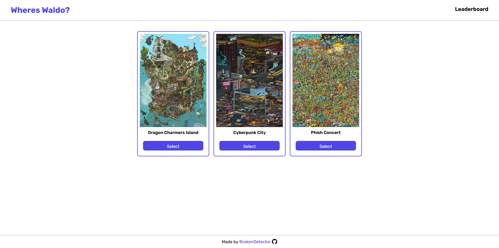
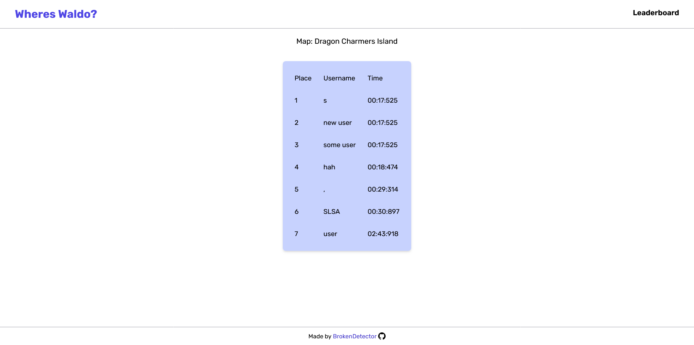

# Where's Waldo (A Photo Tagging App)

 A Where's Waldo (Photo Tagging) game where your goal is to find all the hidden characters.

### Home page

### Game page

### Leaderboard page

## Features

- Click on the photo to place a targeting box and select a character from the dropdown menu.
- Notification that tells you if you found a character or not.
- Record the time taken by the user to identify all characters.
- Display the user's score (time) upon successful identification of all characters.
- Prompt the user to enter their name for the leaderboard where all scores are stored.
- Custom 404 page for invalid urls.

## Technologies Used

- React
- Next.js
- Typescript
- Tailwind CSS
- Drizzle ORM
